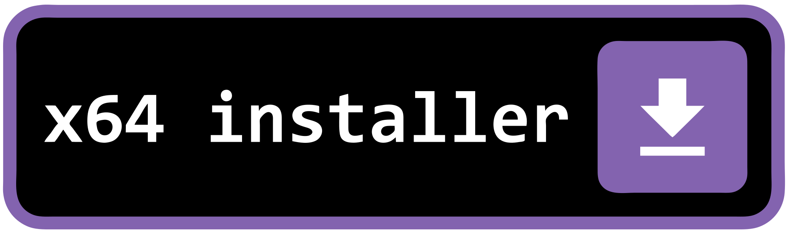

#  DSDeaths

## Download

<table border="0"><tbody><tr>
<td align="center" valign="top">
<a href="https://github.com/fosterbarnes/DSDeaths/releases/download/v1.0.0/DSDeaths_Portable.exe"></a></td>
<td align="center" valign="top">
<a href="https://github.com/fosterbarnes/nvidiaUpd/releases/download/v1.0/nvidiaUpd-x64-installer.exe">
</a></td>
</tr></tbody></table>

## Purpose

This is an automatic death counter for FromSoftware games. It keeps reading your current death count from RAM while the game is running and writes it to a file when it changes. A sample use case is displaying your death count on stream using a Text Source in OBS Studio reading from the created file.
The death count is not reset when you enter NG+.

Forked just to add "Deaths: " before the number in `DSDeaths.txt`. This lets me avoid having two text sources in OBS (one for the label, one for the number)

## Which games are supported?

 * DARK SOULS: Prepare To Die Edition
 * DARK SOULS II
 * DARK SOULS II: Scholar of the First Sin
 * DARK SOULS III
 * DARK SOULS: REMASTERED
 * Sekiro: Shadows Die Twice
 * Elden Ring (offline, disable EAC) - [Mod to disable EAC](https://www.nexusmods.com/eldenring/mods/90)

## How do I use it?

### Portable:

Download and run `DSDeaths_Portable.exe`. Link the .txt file alongside it to an OBS text source

### Installer:

Download and run `DSDeaths_Installer.exe`. Link the .txt file alongside it to an OBS text source

Install location:

```
%LOCALAPPDATA%\DSDeaths\
```
